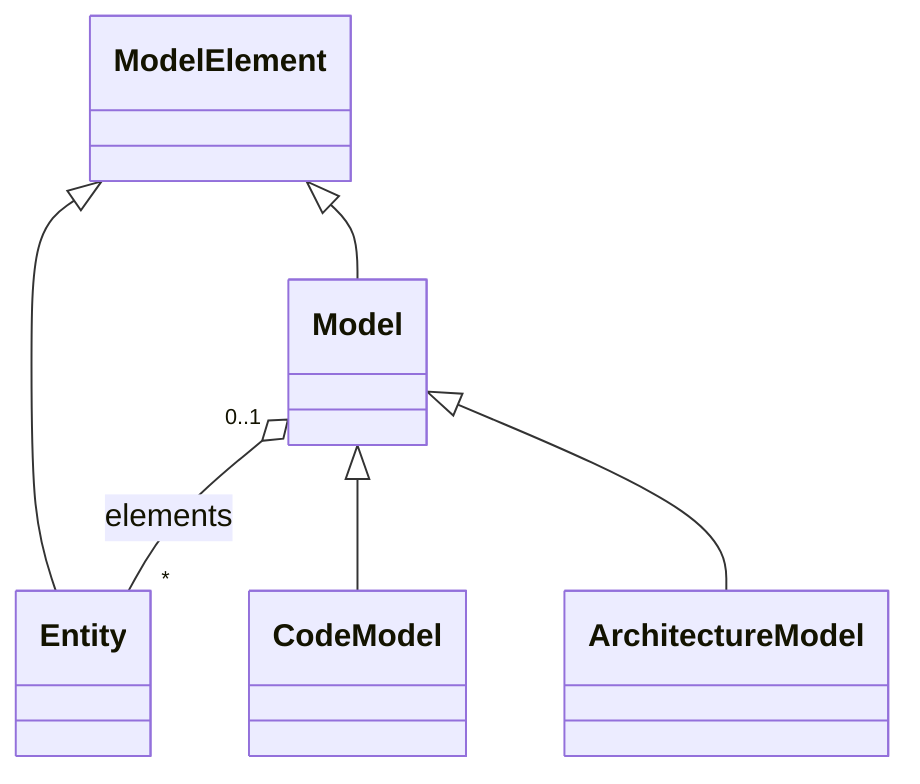
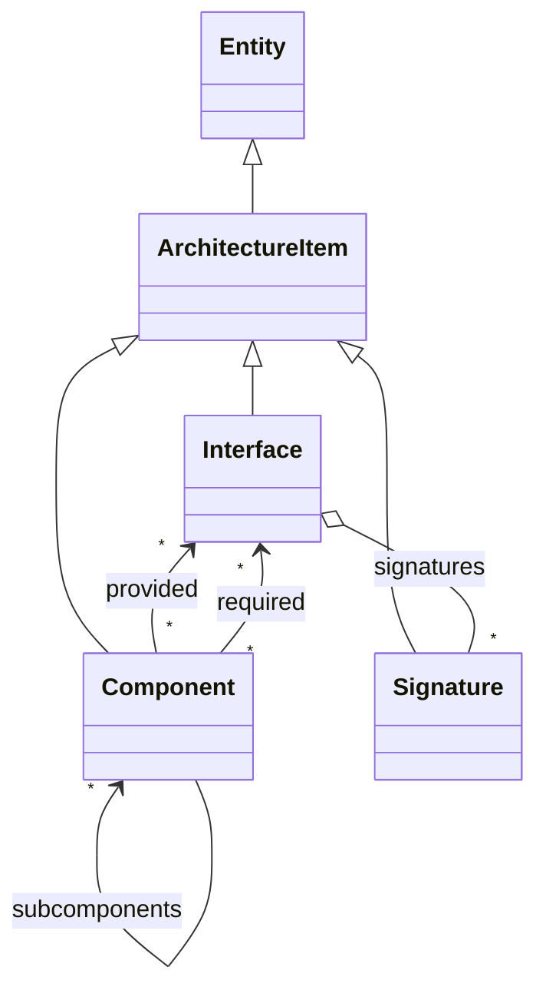
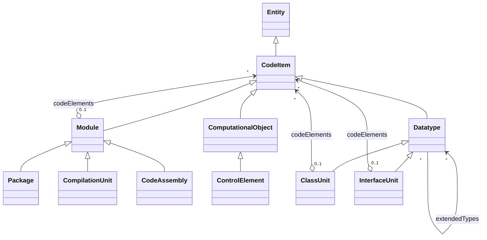

# Intermediate Artifacts

ARDoCo processes various inputs and converts them into standardized intermediate representations. These internal models enable uniform analysis across different documentation formats, modeling languages, and programming languages.

## Overview

ARDoCo uses three main categories of intermediate artifacts:

1. **Text Representation**: Internal model for natural language documentation with linguistic annotations
2. **Software Architecture Models (SAM)**: Unified representation of architecture models from various notations
3. **Code Model**: Standardized representation of source code based on the Knowledge Discovery Model (KDM)

## Text Representation

The input text (Software Architecture Documentation) has an internal representation that preserves all annotations from preprocessing. This includes:

- **Tokenization**: Word boundaries and sentence segmentation
- **Part-of-Speech Tags**: Grammatical categories (nouns, verbs, etc.)
- **Dependency Parsing**: Syntactic relationships between words
- **Named Entity Recognition**: Identified entities and their types
- **Lemmatization**: Base forms of words

Implementation: [Text.java](https://github.com/ardoco/ardoco/blob/main/core/framework/common/src/main/java/edu/kit/kastel/mcse/ardoco/core/api/text/Text.java)

The text representation enables pipeline steps to:
- Access linguistic features computed during preprocessing
- Identify architectural concepts mentioned in documentation
- Extract relationships between entities
- Match documentation terminology to model elements

## Software Architecture Models (SAM)

ARDoCo provides a unified intermediate representation for software architecture models, independent of the original modeling language (UML, PCM, etc.).

### Architecture Elements

Each architecture element is an **ArchitectureItem** inheriting from **Entity**, which provides:
- **name**: Human-readable identifier
- **identifier**: Unique ID within the model

There are three types of ArchitectureItems:

#### Component

Represents architectural elements across different modeling languages:
- **UML**: Corresponds to UML Components
- **PCM**: Encompasses BasicComponent and CompositeComponent
  - BasicComponent: Atomic components without sub-components
  - CompositeComponent: Components containing sub-components

Components can:
- **Provide Interfaces**: Functionality implemented by the component
- **Require Interfaces**: Functionality needed by the component
- **Contain Sub-components**: Hierarchical composition

#### Interface

Defines contracts for component interaction:
- Contains multiple method **Signatures**
- Can be provided or required by components
- Specifies expected behavior without implementation

#### Signature

Represents method declarations within interfaces:
- Associated with a specific Interface (composite relationship)
- Defines method name and structure
- Used for matching documentation to interface operations

### Use Cases

The SAM intermediate model enables:
- **Cross-notation Analysis**: Handle UML, PCM, and other architecture models uniformly
- **Traceability**: Link documentation mentions to model elements
- **Inconsistency Detection**: Identify missing or unmentioned components
- **Hierarchical Navigation**: Traverse component compositions and interface relationships

## Code Model

ARDoCo's code model is based on the source code package of the [Knowledge Discovery Model (KDM)](https://www.omg.org/spec/KDM/1.3/PDF), providing a language-independent representation of source code.

### Code Elements

All code elements inherit from **CodeItem**, which is a specialized **Entity** with name and identifier.

There are three main categories of source code elements:

#### Module

Represents logical components of the system at various abstraction levels. Modules can contain **CodeItems** and come in three types:

**CompilationUnit**:
- Represents a source file
- Includes relative path to file location on disk
- Specifies programming language
- Based partly on KDM's InventoryModel

**Package**:
- Logical collection of source code elements
- Can contain sub-Packages (e.g., Java package hierarchy)
- Organizes code elements into namespaces

**CodeAssembly**:
- Collection of source code artifacts linked together to be runnable
- Example: Source files grouped with their headers
- Represents compiled or executable units

#### Datatype

Represents type definitions in object-oriented languages. There are two kinds:

**ClassUnit**:
- Analogous to classes in Java
- Can contain CodeItems like methods and inner classes
- Supports object-oriented programming concepts

**InterfaceUnit**:
- Represents interface definitions
- Can contain code elements like methods
- Defines contracts for implementation

**Relationships**:
- **implementedTypes**: Implementation relationships (e.g., Java `implements`)
- **extendedTypes**: Inheritance relationships (e.g., Java `extends`)
- Supports multiple inheritance where applicable
- Interfaces can extend other interfaces (Java-style)
- Interfaces can extend classes (TypeScript-style)

#### ComputationalObject

Represents executable code with specific behavior:

**ControlElement**:
- Callable parts with specific behaviors
- Represents functions, procedures, or methods
- Unified representation without distinguishing CallableUnits vs MethodUnits
- Currently does not model parameters, return types (can be extended if needed)

### Design Decisions

**Simplifications from KDM**:
- Primitive datatypes (boolean, int, etc.) not modeled - not needed for current approaches
- No distinction between CallableUnits and MethodUnits
- Parameters and return types not included - can be added if future approaches require them

**Extensibility**:
- If future work requires thorough datatype comparison, the model can be extended with KDM sub-classing
- Additional ComputationalObject types can be added as needed

### Use Cases

The code model enables:
- **Language-Independent Analysis**: Handle Java, C++, Python, etc. uniformly
- **Code-to-Architecture Tracing**: Link code elements to architecture models
- **Structure Extraction**: Understand package hierarchies, class relationships, and method locations
- **Inconsistency Detection**: Find code elements not documented in architecture

## Pipeline Integration

These intermediate artifacts flow through the ARDoCo pipeline:

1. **Input Processing**:
   - Text documents → Text representation with annotations
   - Architecture models → SAM representation
   - Source code → Code model representation

2. **Analysis**:
   - TLR approaches work with Text, SAM, and Code models
   - Extract entities, relationships, and patterns
   - Generate trace link recommendations

3. **Inconsistency Detection**:
   - Compare completeness between representations
   - Identify missing or unmentioned elements
   - Report discrepancies

## Implementation References

- Text API: [edu.kit.kastel.mcse.ardoco.core.api.text](https://github.com/ardoco/ardoco/tree/main/core/framework/common/src/main/java/edu/kit/kastel/mcse/ardoco/core/api/text)
- Architecture Model API: [edu.kit.kastel.mcse.ardoco.core.api.models](https://github.com/ardoco/ardoco/tree/main/core/framework/common/src/main/java/edu/kit/kastel/mcse/ardoco/core/api/models)
- Code Model API: Integrated within the architecture model API
