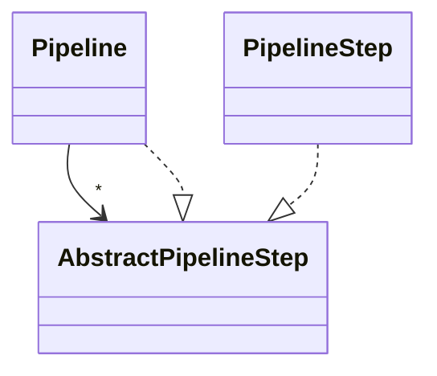

# Pipeline Architecture

The ARDoCo framework uses a flexible, hierarchical pipeline architecture to structure its analysis processes. The pipeline design enables modular composition of analysis steps, clear separation of concerns, and extensibility for new approaches.

## Core Concepts

### Pipeline Structure

The pipeline architecture follows a composite pattern with three key abstractions:



- **AbstractPipelineStep**: Base class for all pipeline components, providing common functionality like execution tracking, logging, and lifecycle management
- **Pipeline**: Container that executes multiple pipeline steps or nested pipelines in sequence
- **PipelineStep**: Concrete implementation of a single processing step

This composite design allows arbitrary nesting of pipelines, enabling multi-level hierarchies where complex workflows can be broken down into manageable, reusable components.

### Three-Level Hierarchy

ARDoCo uses a three-level pipeline structure:

1. **Level 1: Stages** - The overall pipeline defines high-level *stages* such as:
   - Text preprocessing
   - Recommendation generation
   - Connection generation
   - Inconsistency detection

2. **Level 2: Agents** - Each stage is a pipeline containing multiple *agents* that:
   - Initiate processing for specific tasks
   - Coordinate execution of multiple informants
   - Collect and aggregate results from informants

3. **Level 3: Informants** - Agents use concrete *PipelineSteps* called *Informants* to:
   - Execute specific heuristics or algorithms
   - Process data and extract information
   - Store results in the shared data repository

### Data Repository (Blackboard Pattern)

Pipeline steps store and access results through a centralized **DataRepository**, similar to the blackboard pattern:

- **Universal Access**: All pipeline steps can access the repository
- **Shared State**: Results from previous steps are available to subsequent steps
- **Modular Communication**: Steps communicate through the repository rather than directly
- **Type-Safe Storage**: Data is stored with unique identifiers and type information

This architecture enables:
- **Incremental Processing**: Each step builds on results from previous steps
- **Heuristic Cooperation**: Multiple informants can contribute complementary analyses
- **Result Reuse**: Expensive computations can be cached and reused
- **Observability**: Intermediate results are accessible for debugging and analysis

## Pipeline Execution

### Execution Flow

1. **Initialization**: Pipeline creates and configures all steps
2. **Preparation**: Each step prepares its dependencies and validates prerequisites
3. **Sequential Execution**: Steps execute in the order they were added
4. **Timing & Logging**: Execution time and progress are logged for each step
5. **Result Storage**: Each step stores its results in the DataRepository

### Example: TLR Pipeline

The Traceability Link Recovery (TLR) pipeline demonstrates the hierarchical structure:

```
TLR Pipeline (Stage)
├── Text Extraction Agent
│   ├── Architecture Documentation Extractor (Informant)
│   └── Model Extractor (Informant)
├── Text Preprocessing Agent
│   ├── NLP Preprocessing (Informant)
│   └── Dependency Parsing (Informant)
├── Recommendation Generator Agent
│   ├── Name-Based Recommender (Informant)
│   ├── Type-Based Recommender (Informant)
│   └── Context-Based Recommender (Informant)
└── Connection Generator Agent
    ├── Connection Voter (Informant)
    └── Link Threshold Filter (Informant)
```

## Extensibility

The pipeline architecture supports multiple extension points:

### Adding New Approaches

1. Implement a new `PipelineStep` (Informant) with your algorithm
2. Add the step to an existing Agent or create a new Agent
3. Access required data from the DataRepository
4. Store your results back to the repository

### Configuring Pipelines

Pipelines can be configured programmatically:

```java
var pipeline = new Pipeline("MyPipeline", dataRepository);
pipeline.addPipelineStep(new MyCustomStep("step1", dataRepository));
pipeline.addPipelineStep(new AnotherStep("step2", dataRepository));
pipeline.run();
```

### Nested Pipelines

Create complex workflows by nesting pipelines:

```java
var mainPipeline = new Pipeline("Main", dataRepository);
var subPipeline = new Pipeline("Sub", dataRepository);
subPipeline.addPipelineStep(step1);
subPipeline.addPipelineStep(step2);
mainPipeline.addPipelineStep(subPipeline);
```

## Implementation Details

For the complete implementation, see:
- [Pipeline.java](https://github.com/ardoco/ardoco/blob/main/core/framework/common/src/main/java/edu/kit/kastel/mcse/ardoco/core/pipeline/Pipeline.java)
- [AbstractPipelineStep.java](https://github.com/ardoco/ardoco/blob/main/core/framework/common/src/main/java/edu/kit/kastel/mcse/ardoco/core/pipeline/AbstractPipelineStep.java)
- [Ardoco.java](https://github.com/ardoco/ardoco/blob/main/core/pipeline-core/src/main/java/edu/kit/kastel/mcse/ardoco/core/execution/Ardoco.java) - Main pipeline entry point
